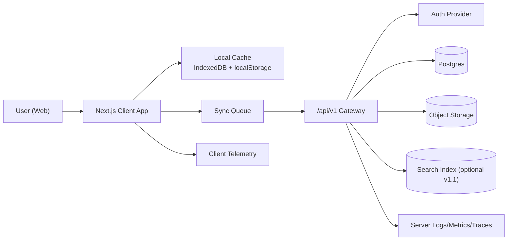
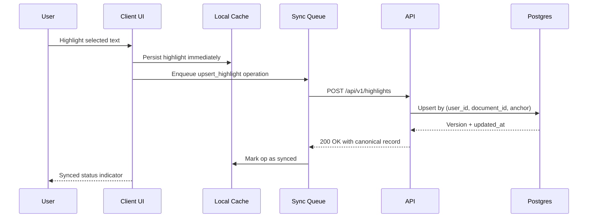
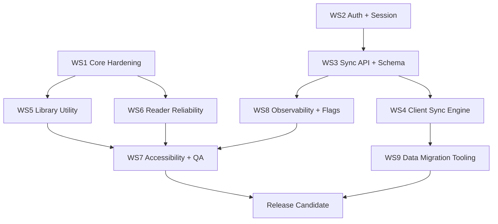

# Glyph Production Readiness and Utility Expansion

Generated: 2026-02-16 14:27
Document ID: PRD-glyph-production-readiness-and-utility-expansion

## Title and Revision
- Title: Glyph v1.0 Production Readiness and Utility Expansion
- Status: Draft for implementation
- Owner: Product + Engineering (app owner)
- Reviewers: Frontend Lead, Platform Lead, Security Lead, QA Lead
- Created: 2026-02-16
- Last updated: 2026-02-16
- Target release: Private Beta by 2026-04-17, Public Beta by 2026-05-29
- Related tickets/docs:
- `RALPH_TASK.md`
- `ralph/tasks-done/001-document-types-storage.md`
- `ralph/tasks-done/002-tokenization-word-mapping.md`
- `ralph/tasks-done/003-library-paste-text.md`
- `ralph/tasks-done/004-text-reader-scaffold.md`
- `ralph/tasks-done/005-text-render-selection.md`
- `ralph/tasks-done/006-text-highlights-notes.md`
- `ralph/tasks-done/007-text-bookmarks-position.md`
- `ralph/tasks-done/008-speed-read-selection-resume.md`
- `ralph/tasks-done/009-pdf-page-indicator-home-button.md`

## Executive Summary
- Problem statement:
- Glyph has strong reader UX primitives, but it is still a local-device prototype with no account system, no cross-device sync, no operational telemetry, and gaps in core workflows (for example full-document speed-read from text reader top bar is not wired in `src/components/text/TextReader.tsx`).
- Proposed change:
- Deliver a production-ready v1 architecture that keeps local-first speed while adding authenticated cloud sync, robust failure handling, measurable reliability, stronger accessibility, and higher utility features (library discovery, reading continuity, and export/share).
- Expected user and business impact:
- Users can rely on Glyph across sessions/devices and recover from failures without data loss.
- Reading and annotation workflows become dependable enough for daily use.
- Team gets observability and release controls to safely iterate.
- Delivery strategy summary:
- Phase 1 (Hardening): fix correctness and UX gaps in current flows, add test coverage, accessibility, and local data protections.
- Phase 2 (Cloud Sync): add auth, server-side document metadata, synced highlights/bookmarks/progress, and conflict-safe offline queue.
- Phase 3 (Utility): ship search/filter, richer progress/resume, and controlled sharing/export improvements.

## Problem and Goals
### Problem Details
- Current pain:
- Current state is local-only (`src/lib/storage.ts` uses localStorage + IndexedDB without remote source of truth), so user data is device-scoped and fragile.
- Some behavior is incomplete or inconsistent:
- Text reader top-bar speed-read action is a placeholder (`handleSpeedRead` no-op in `src/components/text/TextReader.tsx`).
- PDF selection-to-word mapping is heuristic and can be wrong when selected text repeats (`indexOf`-based mapping in `src/components/pdf/PDFTextLayer.tsx`).
- Document progress model is incomplete for PDFs (metadata field exists but update flow is partial).
- Release safety is low:
- No tests in repo for core flows.
- No telemetry, alerting, or feature flags.
- No backend security boundaries.
- Evidence and metrics:
- Architecture evidence from source:
- Local-only persistence: `src/lib/storage.ts`
- Client-only flow orchestration: `src/app/page.tsx`, `src/app/reader/[id]/page.tsx`, `src/app/speed-read/page.tsx`
- UI framework and theme style: `src/app/globals.css`
- Why now:
- The product already has meaningful reading value; production hardening now converts prototype momentum into a usable, retainable product.
- Deferring reliability/security foundations increases migration cost and user-trust risk.

### Goals
- Goal 1:
- Reach production-readiness baseline for reliability, security, and observability while preserving local-first responsiveness.
- Goal 2:
- Provide account-backed sync for documents metadata, bookmarks, highlights, and reading state across devices.
- Goal 3:
- Improve utility so daily reading workflows are complete, discoverable, and recoverable.
- Goal 4:
- Establish release process with objective quality gates and rollback controls.

## Non-Goals
- Out of scope item 1:
- Real-time multi-user co-annotation/editor collaboration in v1.
- Out of scope item 2:
- Native mobile applications (iOS/Android) in v1.
- Out of scope item 3:
- OCR pipeline for scanned PDFs in v1 (flagged as future extension).

## Scope
### In Scope
- Capability 1:
- Correctness and UX hardening of existing flows (library, reader, speed-read, annotations, resume).
- Capability 2:
- Auth + cloud sync backend, with local-first offline queue and conflict resolution for annotation/progress.
- Capability 3:
- Data model versioning, migration tooling, and backward compatibility for existing local users.
- Capability 4:
- Accessibility improvements (keyboard, semantics, contrast, focus management) for key workflows.
- Capability 5:
- Observability, alerting, and release gating (flags, phased rollout, rollback criteria).
- Capability 6:
- Utility upgrades: library filtering/search, reliable progress indicators, richer export/share baseline.

### Out of Scope
- Capability A:
- Full collaborative workspace and team permissions matrix.
- Capability B:
- AI summarization/semantic tutor features.
- Capability C:
- Enterprise compliance certification programs (SOC2 audit execution).

## User Personas and Use Cases
### Primary Persona
- Persona: Focused Reader (students, researchers, knowledge workers)
- Core need: Read long-form documents quickly, annotate meaningfully, resume anywhere, and trust data durability.

### Use Cases
1. Use case:
- Ingest PDF or pasted text, read in reader, annotate, and resume on another device.
2. Use case:
- Select text and speed-read from precise position, then return exactly to contextual position.
3. Use case:
- Search library and document content to find previously annotated passages quickly.
4. Use case:
- Export annotations for review/sharing without losing attribution context.

## Current State and Gaps
- Existing implementation:
- UI style and interaction model:
- Dark-first zinc palette with red accent and compact control bars (`src/app/globals.css`, `src/components/pdf/PDFControls.tsx`).
- Card-based library with upload and text-paste entry (`src/app/page.tsx`, `src/components/library/*`).
- Two reader surfaces:
- PDF reader with virtualization, search, highlights, bookmarks, and export (`src/components/pdf/PDFViewer.tsx`).
- Text reader with word-indexed rendering, highlights, bookmarks, and sidebar notes/bookmarks (`src/components/text/TextReader.tsx`).
- Speed reader route with ORP playback and session-based return (`src/app/speed-read/page.tsx`, `src/components/SpritzReader.tsx`, `src/lib/speed-read.ts`).
- Persistence model:
- IndexedDB for content blobs (`pdfs`, `texts` stores), localStorage for metadata/preferences/annotations (`src/lib/storage.ts`).
- Known limitations:
- No auth/multi-device sync/source-of-truth backend.
- No telemetry, tracing, or production alerting.
- Incomplete/fragile flows:
- TextReader top speed-read button not wired.
- PDF selection mapping can choose wrong position for repeated text.
- Search/highlight mapping in PDFs is text-extraction dependent and can drift.
- No automated regression suite.
- Limited accessibility QA for keyboard and screen readers.
- Technical debt considerations:
- State synchronization relies heavily on ad-hoc localStorage calls across hooks.
- Client components own critical business logic; no contract boundaries for server sync.
- Limited schema governance/versioning for future migrations.

## Proposed Solution
### Functional Design
- Feature behavior:
- Local-first + cloud-synced model:
- User actions apply immediately to local cache.
- Background sync queue commits to server APIs.
- Conflict policy is deterministic and user-safe.
- Complete reading workflows:
- Fix incomplete actions (text-reader full-document speed-read).
- Standardize resume/progress semantics across PDF and text.
- Improve discovery:
- Library search/filter/sort by title, type, last opened, annotated state.
- Reader search and sidebar navigation remain first-class.
- Hardened annotation experience:
- Reliable selection mapping, deterministic highlight anchor model, and conflict-safe merging.
- Operationally safe releases:
- Feature flags, telemetry dashboards, rollback triggers.
- User flow:
1. User signs in (or continues offline as guest mode based on flag).
2. User uploads/pastes content, document appears instantly in library.
3. User reads, annotates, bookmarks, speed-reads from selection/full document.
4. Actions persist locally and sync in background with visible sync state.
5. User opens another device and resumes from last synced state.
- System interactions:
- Browser app talks to `/api/v1/*` for metadata + sync.
- Binary content stored in object storage; metadata in Postgres.
- Local queue handles retries/backoff and sync conflict resolution.

### Technical Design Summary
- Components and services touched:
- Frontend:
- Existing routes/components under `src/app/*`, `src/components/*`, `src/hooks/*`, `src/lib/*`.
- New server/API layer:
- Next.js route handlers (`src/app/api/v1/*`) or separate API service (same contracts).
- Data services:
- Postgres for metadata/annotations/progress.
- Object storage for document blobs.
- Auth provider for user identity and session.
- Data flows:
- `UI action -> local reducer/cache -> enqueue sync op -> API commit -> ack/version update`.
- Backward compatibility approach:
- Existing local data is imported to account on first sign-in.
- Keep local mode path available during migration flag window.

## Architecture
### System Diagram


### Sequence Diagram


## Data Model and Schemas
### Data Entities
- Entity: `users`
- Responsibility: identity and profile ownership for content.
- Constraints: unique auth provider subject.
- Entity: `documents`
- Responsibility: metadata for each document.
- Constraints: `kind in ('pdf','text')`, owner-scoped visibility.
- Entity: `document_assets`
- Responsibility: storage references for binary/text payloads.
- Constraints: one active asset per document/version.
- Entity: `bookmarks`
- Responsibility: persisted reading positions (`page` for pdf, `word_index` for text).
- Constraints: exactly one of `page` or `word_index` present.
- Entity: `highlights`
- Responsibility: annotations with robust anchors.
- Constraints: exactly one anchor type present (`pdf_rects_jsonb` vs `word_range`).
- Entity: `reading_positions`
- Responsibility: last known position, mode, and progress.
- Constraints: one active row per `(user_id, document_id)`.
- Entity: `sync_operations`
- Responsibility: idempotency and conflict trace for client sync.
- Constraints: unique client operation id.

### Schema Changes
```sql
-- Core documents table
create table if not exists documents (
  id uuid primary key,
  user_id uuid not null,
  kind text not null check (kind in ('pdf', 'text')),
  title text not null,
  file_name text,
  page_count integer,
  word_count integer,
  preview_text text,
  created_at timestamptz not null default now(),
  updated_at timestamptz not null default now(),
  deleted_at timestamptz
);

create index if not exists idx_documents_user_updated
  on documents (user_id, updated_at desc)
  where deleted_at is null;

-- Unified bookmarks
create table if not exists bookmarks (
  id uuid primary key,
  user_id uuid not null,
  document_id uuid not null references documents(id) on delete cascade,
  kind text not null check (kind in ('pdf', 'text')),
  page integer,
  word_index integer,
  label text,
  created_at timestamptz not null default now(),
  updated_at timestamptz not null default now(),
  check (
    (kind = 'pdf' and page is not null and word_index is null) or
    (kind = 'text' and word_index is not null and page is null)
  )
);

-- Unified highlights
create table if not exists highlights (
  id uuid primary key,
  user_id uuid not null,
  document_id uuid not null references documents(id) on delete cascade,
  kind text not null check (kind in ('pdf', 'text')),
  color text not null check (color in ('yellow','green','blue','pink','orange')),
  text_excerpt text not null,
  note text,
  page integer,
  rects_jsonb jsonb,
  start_word integer,
  end_word integer,
  created_at timestamptz not null default now(),
  updated_at timestamptz not null default now(),
  check (
    (kind = 'pdf' and page is not null and rects_jsonb is not null and start_word is null and end_word is null) or
    (kind = 'text' and start_word is not null and end_word is not null and page is null and rects_jsonb is null)
  )
);

create index if not exists idx_highlights_doc_updated
  on highlights (document_id, updated_at desc);

-- Reader progress
create table if not exists reading_positions (
  user_id uuid not null,
  document_id uuid not null references documents(id) on delete cascade,
  last_page integer,
  last_word_index integer,
  source text not null default 'reader',
  updated_at timestamptz not null default now(),
  primary key (user_id, document_id)
);
```

## API and Interface Changes
### API Contract
- Endpoint: `POST /api/v1/documents`
- Method: `POST`
- Auth requirements: Required (session or bearer token)

```http
POST /api/v1/documents
Content-Type: application/json
Authorization: Bearer <token>
```

```json
{
  "kind": "text",
  "title": "Atomic Habits Notes",
  "content": "Long pasted content...",
  "clientOperationId": "1ea45f6f-28bf-4a2d-b749-6f5d6e0c9c63"
}
```

```json
{
  "document": {
    "id": "93d312e6-e15d-4ccf-b7c0-4ded2e12ba09",
    "kind": "text",
    "title": "Atomic Habits Notes",
    "wordCount": 4212,
    "previewText": "Long pasted content...",
    "updatedAt": "2026-02-16T22:00:23.123Z"
  },
  "syncVersion": 14
}
```

- Endpoint: `POST /api/v1/highlights`
- Method: `POST`
- Auth requirements: Required

```http
POST /api/v1/highlights
Content-Type: application/json
Authorization: Bearer <token>
```

```json
{
  "id": "0ef88863-f991-4f49-b5ce-57ce2f889fb1",
  "documentId": "93d312e6-e15d-4ccf-b7c0-4ded2e12ba09",
  "kind": "text",
  "color": "yellow",
  "textExcerpt": "Habits are the compound interest of self-improvement",
  "startWord": 151,
  "endWord": 160,
  "note": "Use in onboarding deck",
  "clientOperationId": "03e2bd8f-f326-49a1-ac20-b7e5f31c7f87"
}
```

```json
{
  "highlight": {
    "id": "0ef88863-f991-4f49-b5ce-57ce2f889fb1",
    "updatedAt": "2026-02-16T22:01:10.430Z",
    "version": 8
  }
}
```

- Endpoint: `POST /api/v1/sync/batch`
- Method: `POST`
- Auth requirements: Required

```http
POST /api/v1/sync/batch
Content-Type: application/json
Authorization: Bearer <token>
```

```json
{
  "clientId": "web-8f56",
  "sinceVersion": 10,
  "operations": [
    {
      "id": "op-101",
      "type": "UPSERT_BOOKMARK",
      "payload": { "documentId": "93d312e6-e15d-4ccf-b7c0-4ded2e12ba09", "kind": "text", "wordIndex": 880 }
    }
  ]
}
```

```json
{
  "acknowledged": ["op-101"],
  "remoteChanges": [
    {
      "type": "UPSERT_READING_POSITION",
      "payload": { "documentId": "93d312e6-e15d-4ccf-b7c0-4ded2e12ba09", "lastWordIndex": 890 }
    }
  ],
  "newVersion": 15
}
```

### Internal Interfaces
```ts
export type SyncOpType =
  | "UPSERT_DOCUMENT"
  | "UPSERT_BOOKMARK"
  | "UPSERT_HIGHLIGHT"
  | "DELETE_HIGHLIGHT"
  | "UPSERT_READING_POSITION";

export interface SyncOperation<TPayload = unknown> {
  id: string;
  type: SyncOpType;
  documentId?: string;
  payload: TPayload;
  createdAt: number;
  retryCount: number;
}

export interface SyncEngine {
  enqueue<T>(operation: SyncOperation<T>): void;
  flush(): Promise<{ acknowledged: string[]; failed: string[] }>;
  getStatus(): "idle" | "syncing" | "offline" | "error";
}

export interface ConflictResolver {
  resolveHighlight(local: HighlightDTO, remote: HighlightDTO): HighlightDTO;
  resolveReadingPosition(local: ReadingPositionDTO, remote: ReadingPositionDTO): ReadingPositionDTO;
}
```

## Migrations and Backward Compatibility
- Migration plan:
1. Ship schema and APIs behind flags.
2. Add client migration worker that reads existing local docs/bookmarks/highlights and builds import batches.
3. On first authenticated session, perform one-time import with idempotent `clientOperationId`.
4. Mark imported records locally with `remoteId` and `syncedAt`.
5. Keep local-first writes enabled during rollout.
- Rollback strategy:
- If sync APIs are degraded, disable sync via feature flag.
- App remains usable in local-only mode without destructive migration.
- Compatibility plan for old clients:
- Existing storage normalization remains (`src/lib/storage.ts`), with server sync optional.
- New clients must tolerate missing server fields and continue local operation.
- Data backfill requirements:
- Backfill `word_count` for text docs and `page_count` for PDFs where missing.
- Backfill `last_read_page`/`last_word_index` from local reading state when present.

## Security, Privacy, Compliance
- Authentication and authorization:
- Required auth for all `/api/v1/*` write operations.
- Row-level authorization at DB layer (`user_id` ownership checks).
- Sensitive data handling:
- Documents stored in private object buckets with signed URLs.
- Avoid logging raw document text in server logs.
- Compliance requirements:
- Baseline privacy controls: data deletion, export request endpoint, consent language for sync.
- Abuse and threat considerations:
- Input validation on upload and note fields.
- File size/type enforcement server-side.
- Rate limits for mutation endpoints.
- CSRF protection for cookie-based auth sessions.
- XSS guardrails for any rich rendering paths.

## Performance and Reliability
- Latency targets:
- Library load p95 <= 600 ms (metadata only).
- Reader first-contentful-page p95 <= 2.5 s for 20 MB PDFs on desktop broadband.
- Speed-read launch p95 <= 1.5 s for text docs <= 100k words.
- Throughput targets:
- Support 20 sync operations per second per user burst without data loss.
- Availability target:
- API availability >= 99.9% monthly for beta environment.
- Failure modes and mitigation:
- Offline network: queue and retry with exponential backoff.
- Partial sync failure: idempotent operations and per-op retry status.
- Corrupt local cache: recovery flow with local reset + remote rehydrate.
- Oversized documents: early rejection with user-visible reason and quota guidance.

## Observability and Telemetry
- Logs:
- Structured logs for API mutations with request id, user id hash, operation type, latency.
- Client logs for sync queue transitions and fatal UI errors.
- Metrics:
- `sync_success_rate`, `sync_retry_rate`, `sync_conflict_rate`
- `reader_open_latency_ms`, `speedread_launch_latency_ms`
- `highlight_create_success_rate`, `bookmark_toggle_success_rate`
- Traces:
- End-to-end trace from UI action -> API -> DB for critical write paths.
- Alerts and thresholds:
- Alert when `sync_success_rate < 99%` for 10-minute window.
- Alert when `api_p95_latency_ms > 1200` for 15 minutes.
- Alert when `client_error_rate > 2%` for 15 minutes.

## Feature Flags and Rollout
- Feature flag keys:
- `sync_enabled`
- `auth_required`
- `library_search_enabled`
- `reader_progress_unified`
- `pdf_selection_mapping_v2`
- `textreader_topbar_speedread_enabled`
- Rollout phases:
1. Internal alpha: team-only, `sync_enabled` on for staff accounts.
2. Private beta: 5-10% invited users.
3. Public beta: 50-100% progressive with health checks.
- Guardrail metrics:
- Crash-free sessions >= 99.5%
- Sync success >= 99%
- No P0 security incidents
- Rollback triggers:
- 3 consecutive intervals below sync/error guardrails.
- Any data-loss regression with confirmed reproduction.

## Dependencies and Risks
### Dependencies
- Dependency: Auth provider integration and session middleware
- Owner: Platform
- Needed by date: 2026-03-10
- Dependency: Managed Postgres + object storage + backups
- Owner: Infra
- Needed by date: 2026-03-12
- Dependency: Monitoring stack (Sentry + metrics backend)
- Owner: DevOps
- Needed by date: 2026-03-15
- Dependency: UX accessibility review
- Owner: Design + QA
- Needed by date: 2026-03-20

### Risks
- Risk: Selection-to-word mapping in PDFs remains approximate for complex layouts.
- Impact: Wrong speed-read start position and trust erosion.
- Mitigation: Introduce anchor model v2 with textItem offsets and fallback UI warning when confidence is low.
- Risk: Sync conflicts can overwrite recent annotations.
- Impact: Perceived data loss.
- Mitigation: Conflict resolver by entity type + conflict badge + audit trail.
- Risk: Performance regressions from full-document extraction for speed-read.
- Impact: Slow launches for large PDFs.
- Mitigation: incremental extraction cache + background precompute.
- Risk: Migration failures for legacy local storage.
- Impact: blocked user upgrade.
- Mitigation: idempotent import, dry-run checks, and non-destructive fallback.

## Work Breakdown and Parallelization Plan
### Feature Decomposition
| Feature | Objective | Systems Touched | Owner Role |
| --- | --- | --- | --- |
| WS1 Core Hardening | Fix known correctness and UX gaps in current app | `src/components/*`, `src/hooks/*`, `src/lib/*` | Frontend |
| WS2 Auth + Session | Add login/session and ownership boundaries | API, middleware, auth provider | Platform |
| WS3 Sync API + Schema | Create server contracts and DB tables for metadata/annotations/progress | API, DB migrations | Backend |
| WS4 Client Sync Engine | Offline queue, retries, conflict handling, sync UI state | `src/lib`, `src/hooks`, UI badges | Frontend |
| WS5 Library Utility | Search/filter/sort and scalable library interactions | `src/app/page.tsx`, library components, API | Frontend |
| WS6 Reader Reliability | Improve PDF/text mapping correctness, progress persistence, extraction caching | Reader components, `pdf-utils`, `word-mapping` | Frontend |
| WS7 Accessibility + QA | WCAG fixes + automated tests + regression harness | UI + tests + CI | QA/Frontend |
| WS8 Observability + Flags | Telemetry, dashboards, alerts, release switches | API + client telemetry + config | Platform |
| WS9 Data Migration Tooling | Local-to-cloud import and rollback safety | `src/lib/storage.ts`, API batch import | Frontend/Backend |

### Dependency Declarations
| Workstream | Blocks | Blocked by | Dependency Type (Hard/Soft) |
| --- | --- | --- | --- |
| WS1 Core Hardening | WS5, WS6, WS7 | None | Hard |
| WS2 Auth + Session | WS3, WS4, WS9 | None | Hard |
| WS3 Sync API + Schema | WS4, WS9 | WS2 | Hard |
| WS4 Client Sync Engine | WS5 (sync states), WS6 (progress sync) | WS3 | Hard |
| WS5 Library Utility | None | WS1 (UI cleanup), WS4 (server-backed search optional) | Soft |
| WS6 Reader Reliability | None | WS1 | Soft |
| WS7 Accessibility + QA | Release readiness | WS1, WS5, WS6 | Hard |
| WS8 Observability + Flags | Release readiness | WS2, WS3 | Hard |
| WS9 Data Migration Tooling | Beta rollout | WS2, WS3, WS4 | Hard |

### Dependency DAG


### Parallelization Matrix
| Workstream | Can start now | Parallel with | Blocked by | Required contract | Suggested team or agent |
| --- | --- | --- | --- | --- | --- |
| WS1 Core Hardening | Yes | WS2, WS8 planning | None | Existing component APIs | Codex Frontend Agent A |
| WS2 Auth + Session | Yes | WS1, WS8 | None | Auth token/session contract | Platform Team |
| WS3 Sync API + Schema | No | WS1, WS5 | WS2 | OpenAPI + migration contract v1 | Backend Team |
| WS4 Client Sync Engine | No | WS5, WS6 | WS3 | `/sync/batch` request/response + error codes | Codex Frontend Agent B |
| WS5 Library Utility | Yes | WS1, WS2 | WS1 cleanup recommended | Search query interface | Codex Frontend Agent C |
| WS6 Reader Reliability | Yes | WS1, WS5 | WS1 partial | Selection mapping adapter interface | Codex Frontend Agent D |
| WS7 Accessibility + QA | No | WS8 | WS1/WS5/WS6 merged | Test IDs + acceptance fixtures | QA Team + Codex Test Agent |
| WS8 Observability + Flags | Yes | WS1, WS2 | None | Event naming schema + dashboard spec | Platform Team |
| WS9 Data Migration Tooling | No | WS7 prep | WS4 | Import API + idempotency guarantees | Backend + Codex Data Agent |

### Critical Path
- Step 1: WS2 Auth + Session baseline
- Step 2: WS3 Sync API + DB schema contracts
- Step 3: WS4 Client Sync Engine integration
- Step 4: WS9 Data migration tooling + dry run
- Step 5: WS7 full regression + accessibility gates

### Parallel-Safe Tasks
- Task 1: Wire TextReader top-bar speed-read action and progress update correctness.
- Task 2: Add library search/filter UI with local dataset fallback.
- Task 3: Introduce deterministic PDF selection mapping adapter and confidence scoring.
- Task 4: Add feature-flag client wrapper and no-op fallback.
- Task 5: Build accessibility pass for keyboard focus and ARIA labels.

### Integration Plan
- Merge cadence:
- Daily merges for WS1/WS5/WS6 into an integration branch.
- Contract tests at boundaries:
- Mock `/api/v1/sync/batch` and `/api/v1/highlights` responses before backend is live.
- Cross-stream checkpoints:
- Checkpoint A (end week 1): WS1 + flag scaffolding merged.
- Checkpoint B (end week 2): WS3 schema + mocked WS4 engine integrated.
- Checkpoint C (end week 3): real sync + migration dry run + test suite pass.

## Acceptance Criteria (Given-When-Then)
### Requirement R1
- Requirement: Local reader workflows are functionally complete and consistent.
- Priority: P0
- Dependencies: WS1

Given:
- A user opens any text or PDF document in the reader.
When:
- The user invokes top-bar speed-read, selection speed-read, bookmarks, and returns back.
Then:
- All actions execute successfully with correct start/resume positions and no dead controls.

### Requirement R2
- Requirement: Authenticated cloud sync preserves user data across devices.
- Priority: P0
- Dependencies: WS2, WS3, WS4

Given:
- A signed-in user performs annotations/bookmarks/progress updates on device A.
When:
- The same user opens device B and sync runs.
Then:
- Data appears within SLA and matches canonical conflict policy.

### Requirement R3
- Requirement: Migration from local-only to account mode is non-destructive.
- Priority: P0
- Dependencies: WS3, WS4, WS9

Given:
- A user with pre-existing local-only data signs in for first sync.
When:
- Import job executes.
Then:
- Existing records are imported exactly once and remain available locally if sync fails.

### Requirement R4
- Requirement: Reader performance and reliability meet target SLOs.
- Priority: P0
- Dependencies: WS1, WS6

Given:
- Typical beta datasets and network/device profiles.
When:
- Users open documents and navigate/search/speed-read.
Then:
- Latency/error targets are met and no critical regressions occur.

### Requirement R5
- Requirement: Accessibility baseline passes for primary flows.
- Priority: P1
- Dependencies: WS7

Given:
- Keyboard-only and screen-reader usage.
When:
- Users perform library navigation, reading, annotation, and speed-read controls.
Then:
- Flows meet WCAG 2.1 AA criteria for focus, semantics, and contrast.

### Requirement R6
- Requirement: Library utility supports fast retrieval.
- Priority: P1
- Dependencies: WS5

Given:
- A user with 100+ documents.
When:
- The user filters or searches by title/type/recent use.
Then:
- The desired item is reachable within 3 interactions.

### Requirement R7
- Requirement: Operational visibility and controlled rollout are in place.
- Priority: P0
- Dependencies: WS8

Given:
- A staged rollout with feature flags.
When:
- Error or latency guardrails are breached.
Then:
- Alerts trigger and rollback controls can disable risky features quickly.

### Requirement R8
- Requirement: Data export/delete privacy controls function correctly.
- Priority: P1
- Dependencies: WS3, WS9

Given:
- A signed-in user requests annotation export or account data deletion.
When:
- Request is processed.
Then:
- Output is complete and scoped to user data, and deletions are irreversible after confirmation.

## Test Strategy and Test Matrix
### Strategy
- Unit testing approach:
- Validate tokenization/mapping, conflict resolver, reducers, API validators, and storage adapters.
- Integration testing approach:
- Mock API + real browser storage for queue/sync/migration flows.
- End-to-end testing approach:
- Cover upload/paste/read/annotate/speed-read/resume across auth and offline transitions.

### Matrix
| Requirement | Unit | Integration | End-to-end | Owner |
| --- | --- | --- | --- | --- |
| R1 | `tokenize`, `word-mapping`, reader action handlers | Reader + speed-read session handoff | Full read -> speed-read -> return scenario (pdf/text) | Frontend |
| R2 | Sync op serializer, conflict resolver | `/sync/batch` contract tests with retries | Multi-device sync scenario with offline/online transitions | Frontend + Backend |
| R3 | Migration transformer/idempotency checks | Import API + local cache reconciliation | Existing local user signs in and verifies retained data | Backend + Frontend |
| R4 | Performance-sensitive helpers | Virtualized rendering + extraction cache tests | Benchmark suite on large docs and repeated navigation | Frontend |
| R5 | Accessibility lints and keyboard handler units | Focus trap, aria landmarks, tab ordering tests | Screen reader + keyboard scripted flows | QA |
| R6 | Search/filter reducers | Library query API and local fallback integration | 100+ docs retrieval journey | Frontend |
| R7 | Flag evaluation logic | Telemetry pipeline smoke tests | Canary rollout with synthetic failures | Platform |
| R8 | Export serializer and delete command units | Delete endpoint cascade checks | User-triggered export + deletion confirmation flow | Backend |

## Open Questions and Decision Log
### Open Questions
- Question: Should guest local-only mode remain available after auth launch?
- Owner: Product
- Due date: 2026-02-21
- Question: Is server-side full-text indexing required for beta, or can we ship metadata-only search first?
- Owner: Product + Engineering
- Due date: 2026-02-23
- Question: Which cloud provider stack is final (Vercel + Supabase vs custom API + managed DB)?
- Owner: Platform
- Due date: 2026-02-20
- Question: Do we require encryption of text content beyond provider default at-rest encryption for beta?
- Owner: Security
- Due date: 2026-02-24

### Decisions
- Date: 2026-02-16
- Decision: Keep local-first UX as the primary interaction model.
- Rationale: Preserves performance and offline utility while adding sync durability.
- Date: 2026-02-16
- Decision: Unify bookmarks/highlights across `pdf` and `text` using kind-guarded constraints.
- Rationale: Reduces duplicated logic and aligns with current app design patterns.
- Date: 2026-02-16
- Decision: Ship in phased flags, not big-bang migration.
- Rationale: Minimizes blast radius and enables fast rollback.

### Assumptions
- Assumption: Beta user count is moderate (<10k MAU) and can be supported by managed Postgres/object storage.
- Validation plan: Load test sync and list endpoints before public beta.
- Assumption: Most existing users have local-only data and need one-time import.
- Validation plan: Instrument migration path success/failure and cohort impact.
- Assumption: Team can support concurrent frontend/backend/platform streams.
- Validation plan: Weekly dependency review and critical path tracking.

## Implementation Checklist
- [ ] Requirements finalized and reviewed
- [ ] Architecture approved
- [ ] Contracts frozen for parallel work
- [ ] Migrations reviewed
- [ ] Security review complete
- [ ] Observability plan implemented
- [ ] Tests mapped to all requirements
- [ ] Rollout and rollback plan approved
- [ ] WS1 complete: hardening fixes merged
- [ ] WS2 complete: auth/session contract live
- [ ] WS3 complete: schema + API endpoints live
- [ ] WS4 complete: client sync engine live under flag
- [ ] WS5 complete: library utility enhancements shipped
- [ ] WS6 complete: reader reliability upgrades shipped
- [ ] WS7 complete: accessibility + regression suite passing
- [ ] WS8 complete: telemetry dashboards + alerts active
- [ ] WS9 complete: migration dry-run and production import path validated
